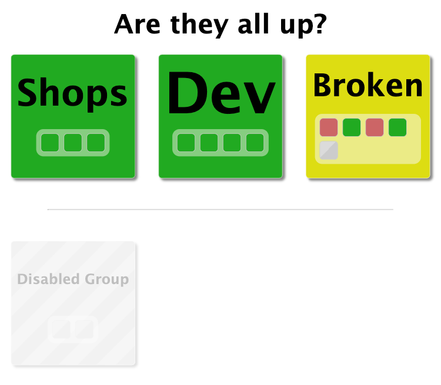
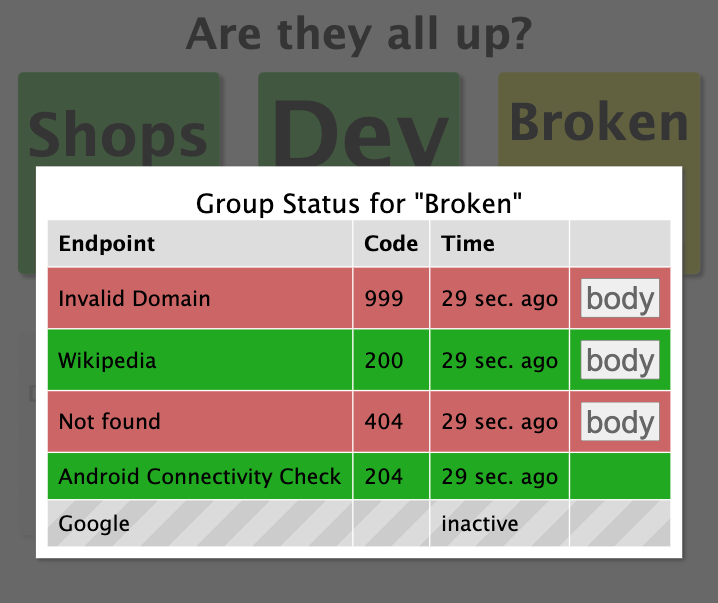

# miStatusBoard

Simple Board to Monitor System Status in Groups

## Configuration File

The configuration is written in YAML.

The configuration contains four top level elements:

- `title` - The title shown in the UI
- `refreshInterval` - The number of seconds between endpoint requests
- `authorization` - How to make sure the accessing user is authorized
- `default_http_method:` - The default HTTP method to use for "http://" or "https://" urls.
- `groups` - The groups (of endpoints) that are monitored

### Groups

The `groups` property is an array of groups, which have the following properties:

- `inactive` - If set to true, the group will be shown greyed out in the UI and the endpoints will not be checked
- `name` - The name to be shown as title in the UI
- `category` - If category is set, the group will be separated from other groups
- `url` - The base URL used for all endpoints that use relative URLs
- `forced_status` - If set the status of the group never changes. Can be "green", "yellow", "red" or "grey"
- `endpoints` - A list of endpoints for the group

### Endpoints

The group's `endpoints` property is an array of endpoints, which have the following properties:

- `inactive` -  If set to true, the endpoint will be shown greyed out in the UI and will not be requested
- `name` - The name to be shown in the UI-endpoints-table
- `url` - The endpoint URL. If relative, the group-URL will be used to resolve it. In addition to "http" and "https", "tcp" is also supported, which only opens a connection on the specified port and closes it directly.
- `method` - The HTTP-method to use if url starts with "http://" or "https://".
- `targetStatus` - The status to test for. If not set checks for status code in the 200 range. It contains the following sub-properties:
  - `code` - (Default: 200) The status code that the endpoint-request should return (not relevant when using "ping://").
  - `body` - (Default: "") If not set to an empty string, the returned data from the endpoint is compared to this. The string must be in base64 to support binary data (not relevant when using "tcp://").


### Authorization

The `authorization` element has the following properties:

- `type` - The type of authorization can be one of:
  - "none"
  - "client-cert"
  - "client-cert-info"

If the type is "client-cert", then the following additional properties are used:

- `header` - The header that contains the client certification as base64
- `cert` - File path of the root certificate to verify against
- `users` - The list of usernames (CN in the client certificate)

If the type is "client-cert-info", then the following additional properties are used:

- `header` - The header that is parsed for the user information (see [#web-server-configuration](Web-Server Configuration))
- `users` - The list of usernames (CN in the client certificate)

### Example Configuration

```yaml
title: Are they all up?
authorization:
  type: client-cert
  header: X-SSL-Client-S-Dn
  users:
    - sirion
refreshInterval: 30
groups:
  - name: Shops
    endpoints:
     - name: Amazon
       url: https://amazon.com/
     - name: eBay
       url: https://ebay.com/
     - name: AliExpress
       url: https://aliexpress.com/
  - name: Dev
    endpoints:
     - name: Codeberg
       url: https://codeberg.org/
     - name: Github
       url: https://github.com/
     - name: GitLab
       url: https://gitlab.com/
     - name: BitBucket
       url: https://bitbucket.com/
  - name: Broken
    endpoints:
     - name: Invalid Domain
       url: https://this-does-not-exist-i-hope.org/
     - name: Wikipedia
       url: https://wikipedia.org/
     - name: Not found
       url: https://google.com/this/does/not/exist/i/hope
     - name: Android Connectivity Check
       url: http://connectivitycheck.android.com/generate_204
       targetStatus:
         code: 204
     - name: Google
       inactive: true
       url: https://google.com/
  - name: Disabled Group
    inactive: true
    endpoints:
     - name: SAP
       url: https://sap.com/
     - name: Oracle
       url: https://oracle.com/
```

[This](doc/example.yaml) would lead to something like this:






## CLI Arguments

You can provide the following arguments when starting the application:

- `port` - (Default: 8765) The web-server port, can also be set via environment variable "PORT"
- `config` - (Default: "./config.yaml") Where to find the configuration file
- `cache` - (Default: "./cache.json") Where the endpoint-results are cached (used to enable a quick start without having to wait for all endpoints to be requested again)

## Web-Server Configuration

This is an example to setup the app with nginx:

```nginx
server {
    server_name SERVERNAME;

    location / {
        if ($ssl_client_verify != SUCCESS) {
            return 403;
        }

        proxy_set_header X-SSL-Client-S-DN $ssl_client_s_dn;
        proxy_http_version 1.1;
        proxy_set_header Upgrade $http_upgrade;
        proxy_set_header Connection "upgrade";

        proxy_pass http://localhost:8765/;
    }

    listen [::]:443 ssl;
    ssl_certificate /PATH/TO/SERVER_CERT;
    ssl_certificate_key /PATH/TO/SERVER_CERT_KEY;

    ssl_verify_client on;
    ssl_client_certificate /PATH/TO/CA/CERT.pem;
}
```

- `if ($ssl_client_verify != SUCCESS) {
    return 403;
}` makes sure the app will only be accessed by people that have a certificate
from the Certificate-Authority that is checked by `ssl_client_certificate`.

- `proxy_set_header X-SSL-Client-S-DN $ssl_client_s_dn;` forwards the user certificate information to the application as header so that the user name can be parsed from it.

- `ssl_verify_client on;` makes the server ask for the client certificate.

- `ssl_client_certificate /PATH/TO/CA/CERT.pem;` checks the client certificate agains the CA-Certificate in the file.

## ToDos

Currently planned further development:

- Enable parsing of JSON responses and support comparing sub-properties
- Make sure there is a graceful error message for users with the right certificate but not in the allowlist
- Live-Frontend directory in debug mode should be checked for existence.
